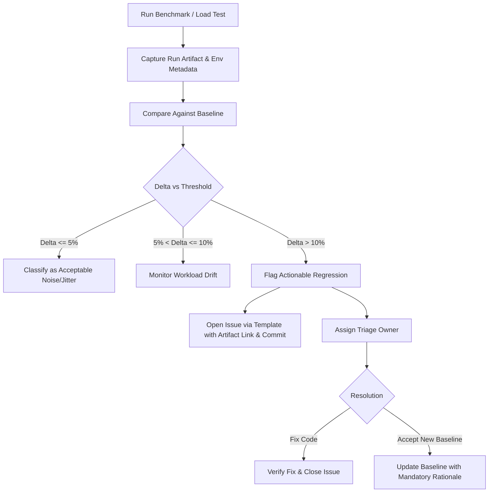

# Performance Regression Triage Runbook

This guide defines the performance regression triage workflow for the xConfess platform.

## Goals

1. **Distinguish noise from regressions**: Avoid chasing transient measurement jitter.
2. **Reproducible artifacts**: Every benchmark run records system environment metadata, commit SHA, and workload metrics.
3. **Accountability & Ownership**: Every detected regression links to the workload and commit, with an assigned triage owner.
4. **Enforced Rationale**: Baseline changes cannot occur without documented, reviewable justification.

## Workflow



## Running the Benchmark Triage Tool

```bash
# Run triage check against existing baseline
node scripts/benchmark-triage.js

# Output JSON report
node scripts/benchmark-triage.js --json

# Update baseline with mandatory rationale (minimum 10 characters)
node scripts/benchmark-triage.js --update-baseline --rationale="Added Redis query caching for confession lists"
```

## Threshold Rules

- **Stable**: Metric variation $\le 5\%$ compared to baseline.
- **Noise / Jitter**: Metric variation between $5\%$ and $10\%$. Recorded in artifacts for trend analysis but does not fail builds.
- **Regression**:
  - Latency increase $> 10\%$
  - Throughput decrease $> 10\%$
  - Any increase in error rate ($> 0\%$)

## Artifact Retention

Benchmark execution reports are saved to `artifacts/benchmarks/run-<timestamp>-<commit>.json` and `artifacts/benchmarks/latest-run.json`. These include sanitized environment details (Node version, OS, CPU cores, memory) to ensure comparable reruns across environments.
